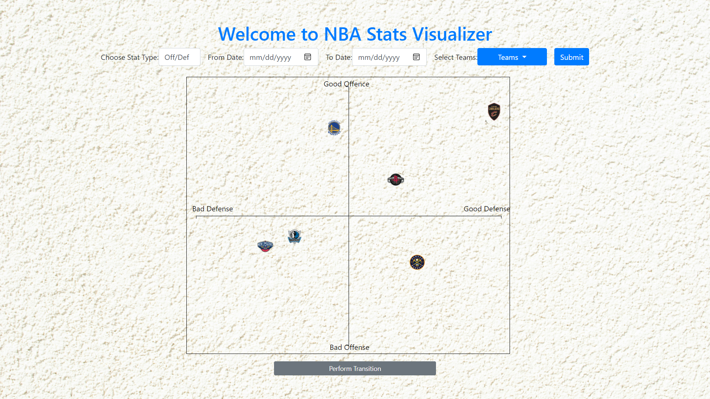

# NBA Stats Visualizer

NBA Stats Visualizer is a comprehensive tool that provides insights into the offensive and defensive statistics of NBA teams over a specific period. This repository empowers users to analyze how team statistics transition over time, offering a dynamic visual representation of performance trends.

## Features

- **Stat Visualization:** Explore offensive and defensive stats of NBA teams over a specified time period.

- **Transition Analysis:** Visualize how team statistics transition and evolve over the chosen period.

- **Data Source:** Utilizes the [nba_api](https://github.com/swar/nba_api) by GitHub user swar for accessing NBA statistics.

- **No Commercial Use:** Please note that NBA and team logos included in the project are for non-commercial use only.

## Getting Started

Follow these steps to get started with NBA Stats Visualizer:

1. Clone the repository:
    ```bash
    git clone https://github.com/your-username/NBA_Stats_Visualizer.git
    cd NBA_Stats_Visualizer
    ```

2. Install dependencies:
    ```bash
    pip install -r requirements.txt
    ```

4. Run the application:
    ```bash
    python -B manage.py runserver
    ```

5. Open your browser and go to [http://localhost:8000](http://localhost:8000) to access the NBA Stats Visualizer interface.

## Usage

1. Choose the specific time period for which you want to visualize NBA team statistics.

2. Explore the offensive and defensive stats of teams using the interactive visualizations.

3. Analyze how team statistics transition and evolve over the chosen period.

## Screenshots

### Please wait for data retrieval 


### View teams stats


## Running with Docker

To run NBA Stats Visualizer using Docker, make sure Docker is installed on your machine. If not, you can download and install Docker from the [official Docker website](https://www.docker.com/get-started).

Follow these steps:

1. Build the Docker image:
    ```bash
    docker-compose build
    ```

2. Start the application:
    ```bash
    docker-compose up
    ```

3. Open your browser and go to [http://localhost:5000](http://localhost:5000) to access the NBA Stats Visualizer interface.

## Contributing

We welcome contributions! If you find any issues or have suggestions for improvements, please open an issue or submit a pull request. Follow our [contribution guidelines](CONTRIBUTING.md).


### Disclaimer

The use of NBA and team logos included in this project is for non-commercial purposes only. It is essential to adhere to the licensing and usage guidelines provided by the NBA for their intellectual property. Make sure to review and comply with the [NBA's logo use policy](https://www.nba.com/privacy-policy) and any additional guidelines from the respective teams before using or distributing this project. This project and its contributors are not affiliated with or endorsed by the NBA or any of its teams. Use discretion and ensure compliance with applicable regulations to avoid any legal issues.


